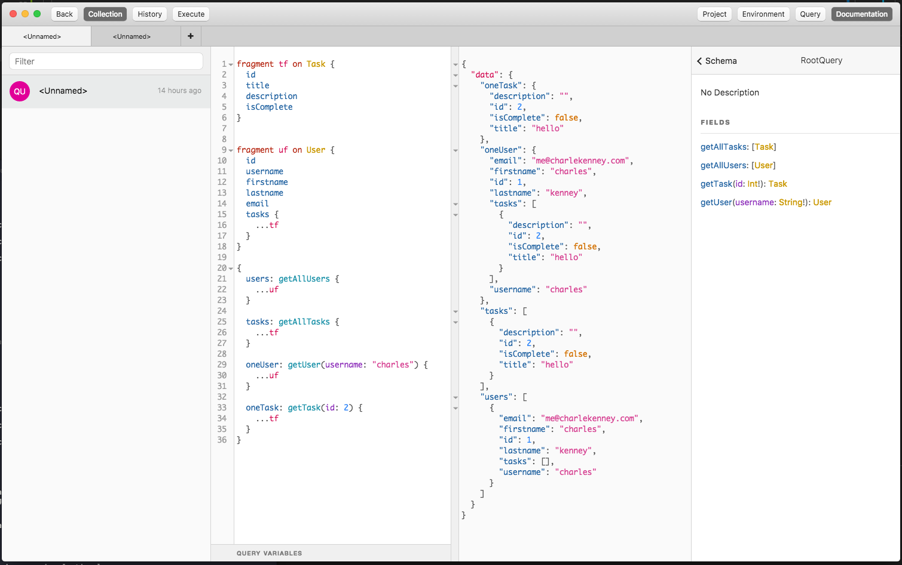
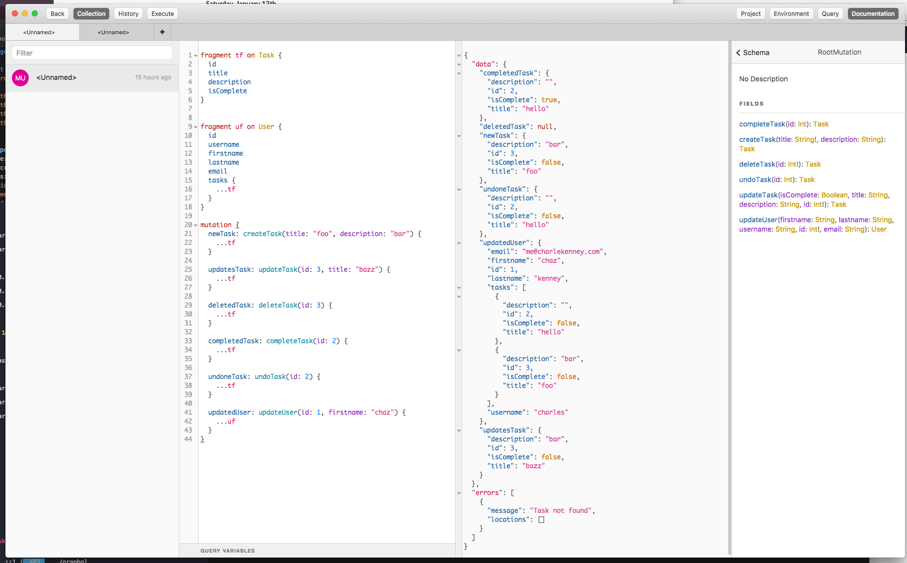

<h1 align="center">
  Go GraphQL Todo
</h1>

  A golang GraphQL todo app using MySQL, Gorm and JWT

<h3 align="center">Queries</h3>

  

<h3 align="center">Mutations</h3>

  

<h2>License 📜</h2>

  &copy; 2018 <a href="https://github.com/charliekenney23">Charles Kenney</a>

